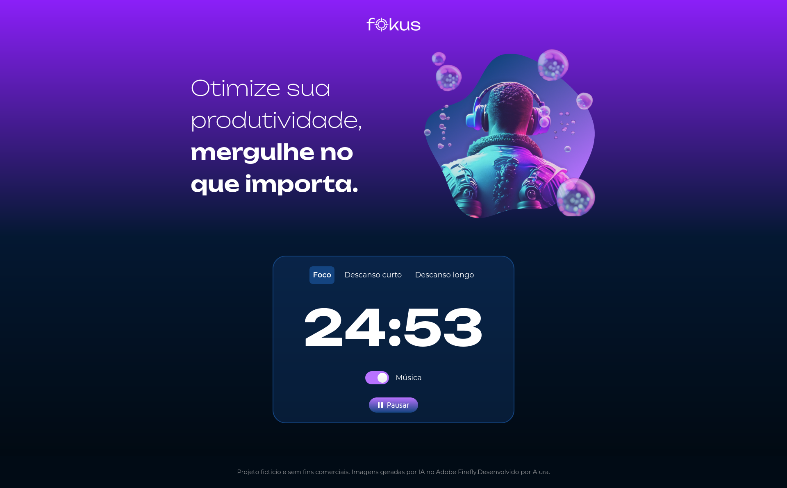
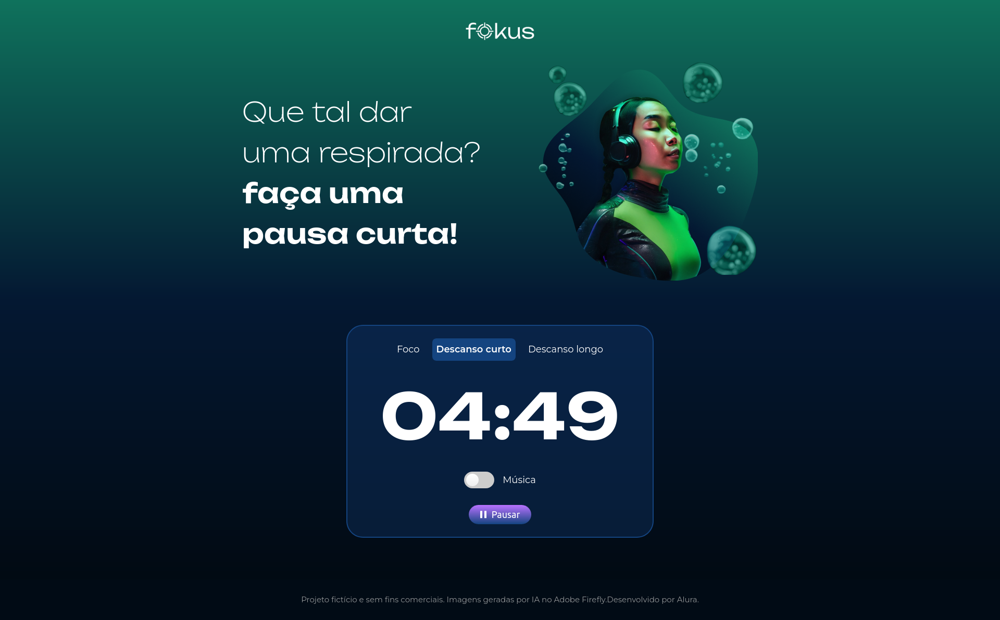
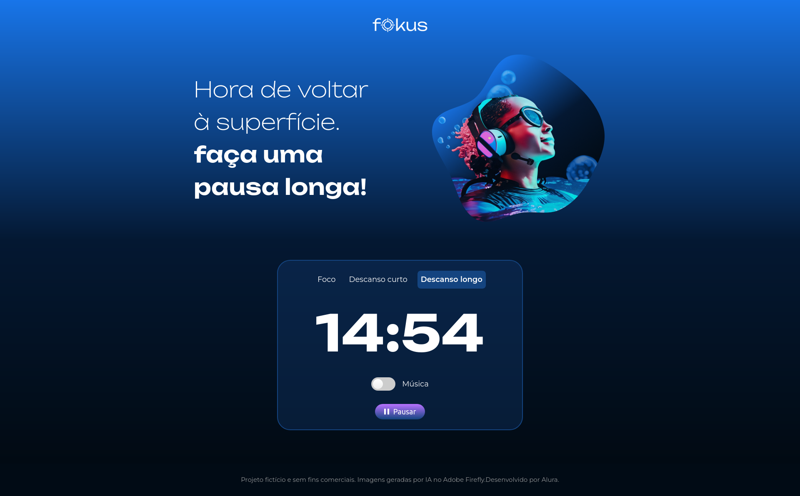

# **Projeto fokus - POMODORO**

Projeto desenvolvido no  **curso de
JavaScript: manipulando o DOM** da ***Alura**, onde se tratar de um pomodoro para o gerenciamento de tempo!!

## Demonstração

### ***Parte do foco***

### ***Parte do descanso curto e longo***

